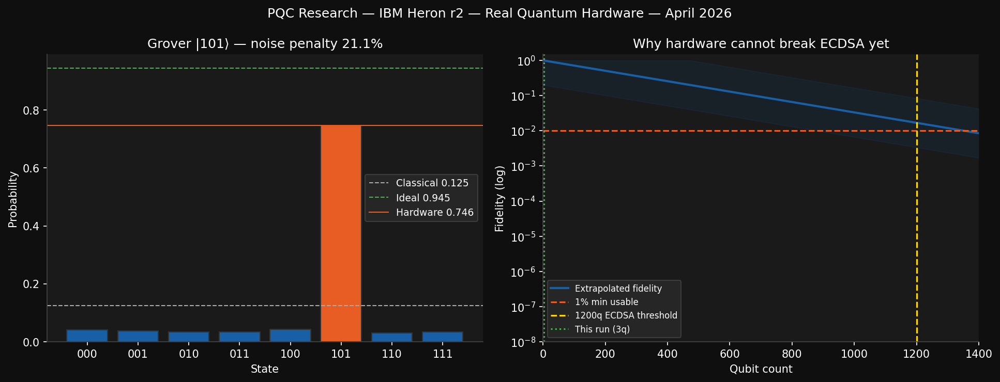

# pqc-falcon-analysis

A source-grounded audit of claims connecting a small IBM Heron Grover experiment to Falcon/FN-DSA and ECDSA security language.

<p align="center">
  
</p>

## At A Glance

| Area | Current read |
| --- | --- |
| Measured result | A recovered 3-qubit IBM Heron Grover run with target-state probability `p_hardware = 0.7461` |
| Formal follow-on work | Two local Aristotle / Lean artifact sets that stress-test proof and sampler assumptions |
| Main verdict | The hardware demo is real, but the strongest Falcon / ECDSA security headlines require unsupported bridge assumptions |
| Best public framing | Small hardware benchmark + rigorous claim audit, not a direct attack claim |

## Why This Repository Exists

This project collects three layers of work in one place:

1. A real IBM hardware benchmark.
2. Local analytical and formal follow-on artifacts.
3. A structured audit of which higher-level cryptographic conclusions are actually supported.

The key contribution is not just the measurement. It is the separation of measured facts, local models, surrogate proofs, and unsupported narrative jumps into a reviewable evidence trail.

## Start Here

- [Recommendation memo](.gpd/phases/01-claim-audit/01-recommendation.md)
- [Claim ledger](.gpd/phases/01-claim-audit/01-claim-ledger.md)
- [Assumption chain](.gpd/phases/01-claim-audit/01-assumption-chain.md)
- [Literature review](.gpd/literature/pqc-falcon-claim-audit-REVIEW.md)
- [Project contract and scope](.gpd/PROJECT.md)
- [Artifact inventory](ARTIFACTS.md)

## Repository Layout

```text
pqc-falcon-analysis/
├── README.md
├── ARTIFACTS.md
├── requirements.txt
├── quantum_pqc__blockchain_research.py
├── QUANTUM_PQC__Blockchain_Research.ipynb
├── docs/
│   └── images/
│       └── grover-results.png
├── artifacts/
│   ├── ibm-heron-job/
│   ├── aristotle-proof-gap-analysis/
│   └── aristotle-surrogate-model/
└── .gpd/
    ├── literature/
    ├── phases/
    └── research-map/
```

## Key Findings

- The measured result supports a 3-qubit target-state probability of approximately `0.7461` for the recovered Grover circuit.
- The fitted `epsilon_gate` term is a local modeling proxy, not a directly measured device-level benchmark.
- The local Lean results are meaningful inside their stated surrogate models, but they do not by themselves establish a deployed-system Falcon break.
- No primary source currently anchors the bridge from this small Grover measurement to Falcon sampler distance or a concrete ECDSA attack timeline.

## Reproducing The Local Python Analysis

Create an environment and install the lightweight Python dependencies:

```bash
python3 -m venv .venv
source .venv/bin/activate
pip install -r requirements.txt
```

To rerun the IBM result recovery path, export your credential first:

```bash
export IBM_QUANTUM_TOKEN='your-token-here'
python quantum_pqc__blockchain_research.py
```

The notebook contains the same logic in interactive form. The exported figure is written to `docs/images/grover-results.png`, which keeps the README preview in sync with the tracked artifact.

## Security Note

A previously embedded IBM Quantum token has been removed from the script and notebook. The old credential should be treated as compromised and rotated in IBM Quantum before any future authenticated runs.

## Status

This repository is organized as a research audit record rather than a packaged software library. The most important outputs today are the audit artifacts, primary-source cross-checks, and preserved source materials for the underlying claim chain.
